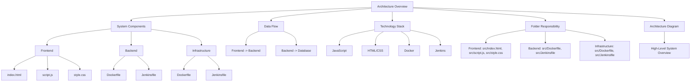

# System Architecture

```mermaid
graph TD
  A[Architecture Overview] --> B[System Components]
  B --> C[Frontend]
  C --> D[index.html]
  C --> E[script.js]
  C --> F[style.css]
  B --> G[Backend]
  G --> H[Dockerfile]
  G --> I[Jenkinsfile]
  B --> J[Infrastructure]
  J --> K[Dockerfile]
  J --> L[Jenkinsfile]
  A --> M[Data Flow]
  M --> N[Frontend -> Backend]
  M --> O[Backend -> Database]
  A --> P[Technology Stack]
  P --> Q[JavaScript]
  P --> R[HTML/CSS]
  P --> S[Docker]
  P --> T[Jenkins]
  A --> U[Folder Responsibility]
  U --> V[Frontend: src/index.html, src/script.js, src/style.css]
  U --> W[Backend: src/Dockerfile, src/Jenkinsfile]
  U --> X[Infrastructure: src/Dockerfile, src/Jenkinsfile]
  A --> Y[Architecture Diagram]
  Y --> Z[High-Level System Overview]
```

> Generated by GitGenius Sentinel